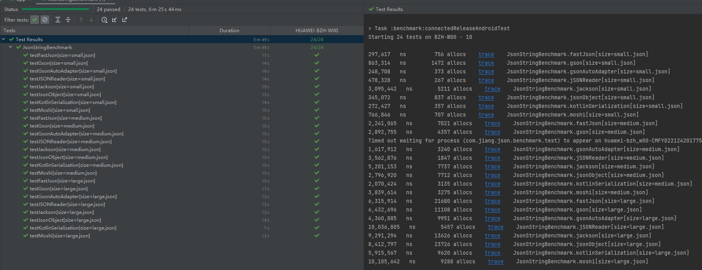

English | **[简体中文](README_zh.md)**

# json-benchmark
- Use the Jetpack Microbenchmark library for benchmark testing to avoid the impact of CPU frequency reduction and JIT optimization on test results.
- The test case input includes three json files of size 12kb, 78kb, and 238kb to test the impact of json size on deserialization speed.
- The test results are divided into the results after multiple runs and sufficient preheating.

## Test results
### Multi-run test results
|                      | small json    | medium json    | large json    |
|----------------------|---------------|----------------|---------------|
| gsonAutoAdapter      | 248708     ns | 1617912 ns     | 4360885    ns |
| Kotlin Serialization | 272427    ns  | 2070424 ns     | 5915567   ns  |
| JSONReader           | 478328    ns  | 3562876   ns   | 10036805  ns  |
| FastJson             | 297617    ns  | 2241065   ns   | 8412797   ns  |
| JSONObject           | 345072    ns  | 2796920   ns   | 4788937   ns  |
| Moshi                | 766846    ns  | 3839614   ns   | 10105642  ns  |
| Gson                 | 863314    ns  | 2892755   ns   | 6432696   ns  |
| Jackson              | 3095442   ns  | 5201153   ns   | 9291294   ns  |

## Gson-Code-gen
- gson automatically generates TypeAdapter, which is the fastest and eliminates reflection. Please refer to [gson_plugin](https://github.com/NBXXF/gson_plugin)