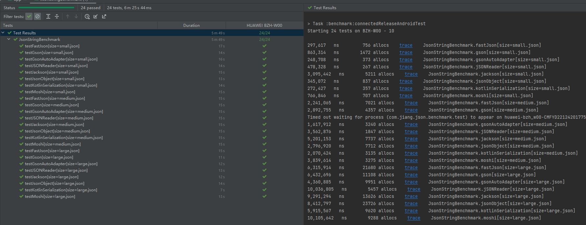

**[English](README.md)** | 简体中文

# json-benchmark
- 通过 Jetpack Microbenchmark 库进行基准测试，以避免 CPU 降频，JIT 优化对测试结果的影响
- 测试用例输入包括 12kb, 78kb,238kb 大小的三个 json 文件，以测试 json 大小对反序列化速度的影响
- 测试结果分为多次运行充分预热后的结果

## 测试结果
### 多次运行测试结果
|                      | small json    | medium json    | large json    |
|----------------------|---------------|----------------|---------------|
| gsonAutoAdapter      | 248708     ns | 1617912 ns     | 4360885    ns |
| Kotlin Serialization | 272427    ns  | 2070424 ns     | 5915567   ns  |
| JSONReader           | 478328    ns  | 3562876   ns   | 10036805  ns  |
| FastJson             | 297617    ns  | 2241065   ns   | 8412797   ns  |
| JSONObject           | 345072    ns  | 2796920   ns   | 4788937   ns  |
| Moshi                | 766846    ns  | 3839614   ns   | 10105642  ns  |
| Gson                 | 863314    ns  | 2892755   ns   | 6432696   ns  |
| Jackson              | 3095442   ns  | 5201153   ns   | 9291294   ns  |

## Gson-Code-gen
- gson 自动生成TypeAdapter 速度最快,杜绝了反射 请参考[gson_plugin](https://github.com/NBXXF/gson_plugin)

